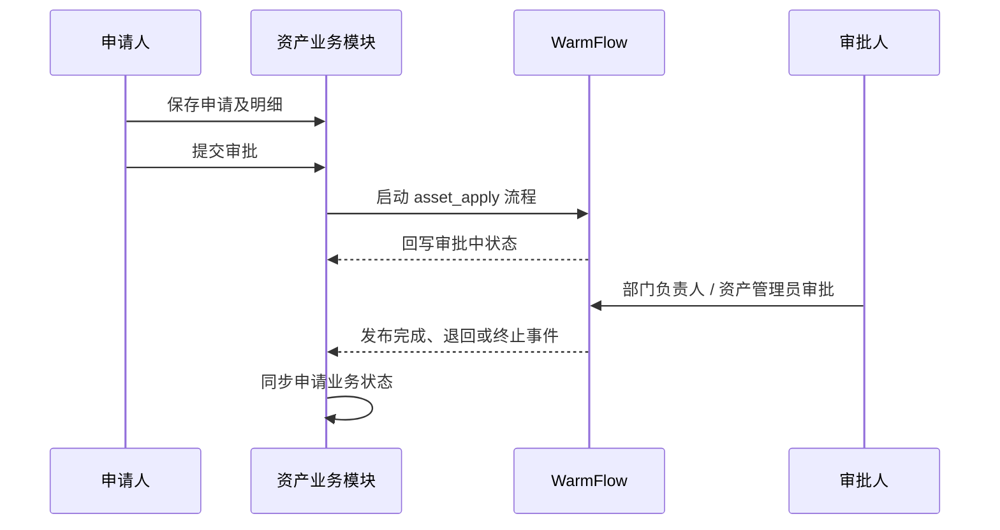
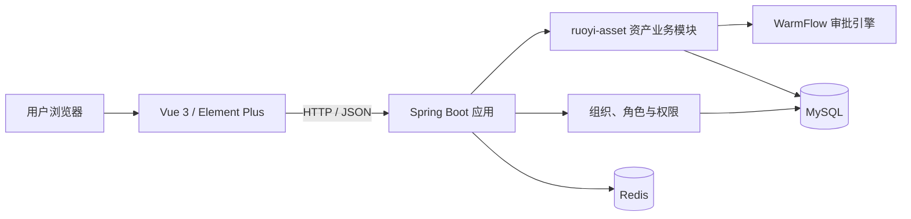
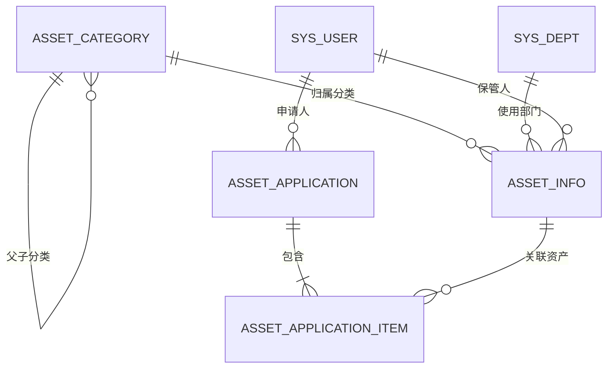

<div align="center">

# 企业资产全生命周期管理平台

**Enterprise Asset Lifecycle Management Platform**

面向集团型企业和大型组织的资产数字化管理系统<br />
实现资产从申请、审批到最终退出的全过程在线化、标准化与可追溯

`Java 17` `Spring Boot 3.5` `Vue 3` `TypeScript` `MyBatis-Plus` `WarmFlow` `Sa-Token` `MySQL` `Redis`

</div>

## 项目简介

企业中的办公设备、IT 设备和生产设备通常分散在不同部门，容易出现台账口径不统一、资产去向不清楚、审批与执行脱节、责任人难追溯等问题。

本项目围绕真实的企业资产管理场景，将资产、组织、人员、申请单和审批流程连接起来，逐步建设覆盖完整生命周期的管理平台：

```text
资产申请 → 审批 → 采购 → 验收入库 → 领用 → 调拨 → 归还 → 维修 → 报废
```

当前版本已经完成资产分类、资产台账、五类资产申请和统一审批主链路，并为采购、库存及后续执行单据预留了清晰的领域边界。

## 项目目标

- 建立统一资产分类、资产编码和资产台账，实现“一物一码”。
- 通过申请单和审批流程规范资产业务入口，避免线下审批失去记录。
- 将资产归属到部门和保管人，使资产状态、位置和责任主体可查询。
- 结合角色、菜单、按钮、租户及数据权限，实现不同组织的数据隔离。
- 沉淀完整资产履历，为盘点、统计分析和审计追踪提供数据基础。

## 当前功能

| 业务模块 | 已实现能力 | 状态 |
|---|---|:---:|
| 项目首页 | 项目简介、生命周期、核心能力、技术架构、快捷入口 | ✅ 已完成 |
| 资产分类 | 多级分类树、编码校验、折旧年限、启停用、引用校验 | ✅ 已完成 |
| 资产台账 | 条件查询、新增修改、部门与保管人、资产状态、删除校验 | ✅ 已完成 |
| 资产申请 | 采购、领用、调拨、归还、报废五类申请及多行明细 | ✅ 已完成 |
| 审批流程 | 申请提交、部门负责人审批、资产管理员审批、审批记录 | ✅ 已完成 |
| 权限控制 | 菜单权限、按钮权限、接口权限、数据权限、租户隔离 | ✅ 已完成 |
| 采购管理 | 采购单、供应商、到货验收 | 🚧 规划中 |
| 库存管理 | 入库、出库、盘点 | 🚧 规划中 |
| 执行单据 | 领用、调拨、归还、维修、报废执行 | 🚧 规划中 |
| 统计分析 | 部门、分类、状态、价值和趋势分析 | 🚧 规划中 |

> 审批完成只代表申请获批，不会直接修改资产台账。后续资产状态变化必须由对应业务执行单据驱动，避免审批逻辑越权代替实际业务。

## 核心业务设计

### 1. 资产分类与台账

- 分类支持多级树形结构，分类编码在租户内唯一。
- 停用分类保留历史数据，但不能继续用于新建资产。
- 存在下级分类或关联资产时禁止删除分类。
- 资产编码在租户内唯一，记录分类、规格、品牌、原值、状态、部门、保管人和位置。
- 非库存资产不能直接删除，必须通过业务单据完成状态流转。

### 2. 统一资产申请

五类申请共用申请主表和明细表，减少重复模型，同时保留不同业务类型的扩展空间。

| 申请类型 | 主要用途 | 资产来源 |
|---|---|---|
| 采购申请 | 申请购置新资产 | 直接填写待采购物品 |
| 领用申请 | 员工或部门领用库存资产 | 选择现有资产台账 |
| 调拨申请 | 资产跨部门或地点流转 | 选择现有资产台账 |
| 归还申请 | 使用中的资产归还库存 | 选择现有资产台账 |
| 报废申请 | 申请资产退出使用 | 选择现有资产台账 |

申请单号、申请人、申请部门和预估总金额均由后端生成或计算，避免信任前端传入的关键业务数据。

### 3. 审批状态协同



- 草稿、退回和撤销状态允许修改或重新提交。
- 提交后由 WarmFlow 管理流程任务和审批记录。
- 业务模块监听流程事件，将流程状态同步到申请表。
- 只有申请人本人可以修改、删除或提交自己的申请。

## 系统架构



后端采用 Maven 多模块结构。资产领域代码集中在独立的 `ruoyi-asset` 模块，登录、组织、权限等通用能力与资产领域逻辑保持分离。

```text
org.dromara.asset
├── controller        # REST 接口、权限、校验与操作日志
├── domain
│   ├── bo            # 查询、新增和修改参数
│   └── vo            # 页面响应模型
├── mapper            # MyBatis-Plus 数据访问与数据权限
└── service
    └── impl           # 业务规则、状态机和流程协同
```

## 技术栈

### 后端

| 技术 | 用途 |
|---|---|
| Java 17 / Spring Boot 3.5 | 应用开发与运行基础 |
| MyBatis-Plus | 数据访问、分页及通用 CRUD |
| Sa-Token | 登录认证与接口权限校验 |
| WarmFlow | 资产申请审批与流程事件 |
| Validation | BO 参数校验与接口约束 |
| MySQL 8 | 业务数据持久化 |
| Redis / Redisson | 缓存及分布式能力 |
| Maven | 多模块依赖与构建管理 |

### 前端

| 技术 | 用途 |
|---|---|
| Vue 3 / TypeScript | 前端业务页面与类型约束 |
| Vite 7 | 开发服务器与生产构建 |
| Element Plus | 企业后台 UI 组件 |
| Pinia | 前端状态管理 |
| Vue Router | 静态及动态权限路由 |
| pnpm | 前端依赖管理 |

## 技术实现亮点

1. **独立领域模块**：资产代码放入 `ruoyi-asset`，没有混入系统管理模块，便于继续扩展采购、库存和执行单据。
2. **统一申请模型**：五类申请复用主表与明细表，通过申请类型区分场景，减少重复代码和重复表结构。
3. **明确状态边界**：审批状态与资产执行状态分离，防止“审批通过”等同于“业务已经执行”。
4. **后端可信计算**：申请人、部门、单号和金额由服务端取得或计算，降低参数伪造风险。
5. **组织数据权限**：资产台账映射部门和保管人字段，在接口权限之外进一步限制数据范围。
6. **多租户隔离**：四张资产业务表均包含 `tenant_id`，编码唯一性和业务查询都在租户范围内处理。
7. **流程事件解耦**：通过流程事件同步申请状态，业务服务不直接操作审批任务内部状态。
8. **安全配置治理**：数据库、Redis 和第三方凭据使用环境变量，本地 `.env` 不进入 Git 仓库。

## 数据模型

当前核心业务表：

| 表名 | 说明 |
|---|---|
| `asset_category` | 资产分类及父子层级 |
| `asset_info` | 资产基础台账 |
| `asset_application` | 资产申请主单 |
| `asset_application_item` | 资产申请明细 |



完整字段和索引设计参见 [数据库设计文档](backend/docs/04-database-design.md)。

## 权限设计

平台使用四层权限控制：

```text
角色菜单权限 → 页面按钮权限 → Controller 接口权限 → 部门/本人数据权限
```

- Controller 使用 `@SaCheckPermission` 控制接口操作权限。
- 前端使用 `v-hasPermi` 控制新增、修改、删除和提交按钮。
- 数据权限将部门范围映射到 `dept_id`，将本人范围映射到 `keeper_id`。
- 资产分类、台账和申请均受租户隔离约束。

## 项目结构

```text
enterprise-asset-lifecycle-platform/
├── backend/
│   ├── ruoyi-admin/                       # 后端启动模块
│   ├── ruoyi-modules/ruoyi-asset/         # 资产业务模块
│   ├── script/sql/asset/asset_init.sql    # 资产表、菜单及流程初始化
│   ├── script/flow/asset_apply.json       # 资产审批流程定义
│   └── docs/                              # 需求、架构、数据库与排障记录
├── frontend/
│   ├── src/api/asset/                     # 资产前端 API
│   └── src/views/asset/                   # 分类、台账、申请和审批页面
├── docs/README.md                         # 项目文档索引
├── NOTICE.md                              # 开源来源说明
└── README.md
```

## 本地运行

### 环境要求

- JDK 17
- Maven 3.8+
- Node.js 20.19+ 或 22.12+
- pnpm
- MySQL 8.x
- Redis 6.x+

### 1. 初始化数据库

依次执行：

```text
backend/script/sql/ry_vue_5.X.sql
backend/script/sql/ry_workflow.sql
backend/script/sql/asset/asset_init.sql
```

资产初始化脚本可重复执行，不会删除已有业务数据。

### 2. 配置并启动后端

```bash
cd backend
cp .env.example .env
# 编辑 .env，填写本机 MySQL 和 Redis 配置
./script/start-dev-with-env.sh
```

后端默认地址：`http://localhost:8080`

### 3. 启动前端

```bash
cd frontend
pnpm install
pnpm dev
```

前端默认地址：`http://localhost:5173`

真实密码、Token 和第三方密钥只能放在本机 `.env` 或密钥管理服务中，不要写入受 Git 跟踪的配置文件。

## 后续计划

- [ ] 采购单、供应商与到货验收
- [ ] 入库、出库与库存盘点
- [ ] 领用、调拨、归还和维修执行单据
- [ ] 报废鉴定与处置记录
- [ ] 资产履历与操作时间轴
- [ ] 部门、分类、状态和价值统计分析
- [ ] Docker Compose 一键部署与自动化测试

## 项目文档

- [项目背景](backend/docs/00-project-background.md)
- [需求说明](backend/docs/01-requirements.md)
- [本地配置](backend/docs/02-local-configuration.md)
- [系统架构](backend/docs/03-system-architecture.md)
- [数据库设计](backend/docs/04-database-design.md)
- [实施与排障记录](backend/docs/12-troubleshooting.md)

## 技术底座与开源说明

本项目在成熟企业后台框架基础上进行资产领域二次开发：

- 后端基础框架：[Dromara / RuoYi-Vue-Plus](https://github.com/dromara/RuoYi-Vue-Plus)
- 前端基础框架：[JavaLionLi / plus-ui](https://github.com/JavaLionLi/plus-ui)

登录认证、组织权限、租户、日志等通用能力来自基础框架；资产分类、资产台账、统一资产申请、资产审批衔接、相关业务页面、初始化 SQL 和项目文档由本项目新增。

本仓库保留上游 MIT License 与版权声明，详细信息参见 [NOTICE.md](NOTICE.md)。
