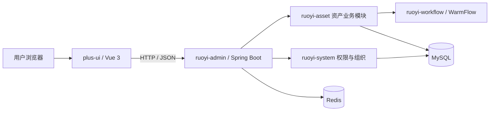
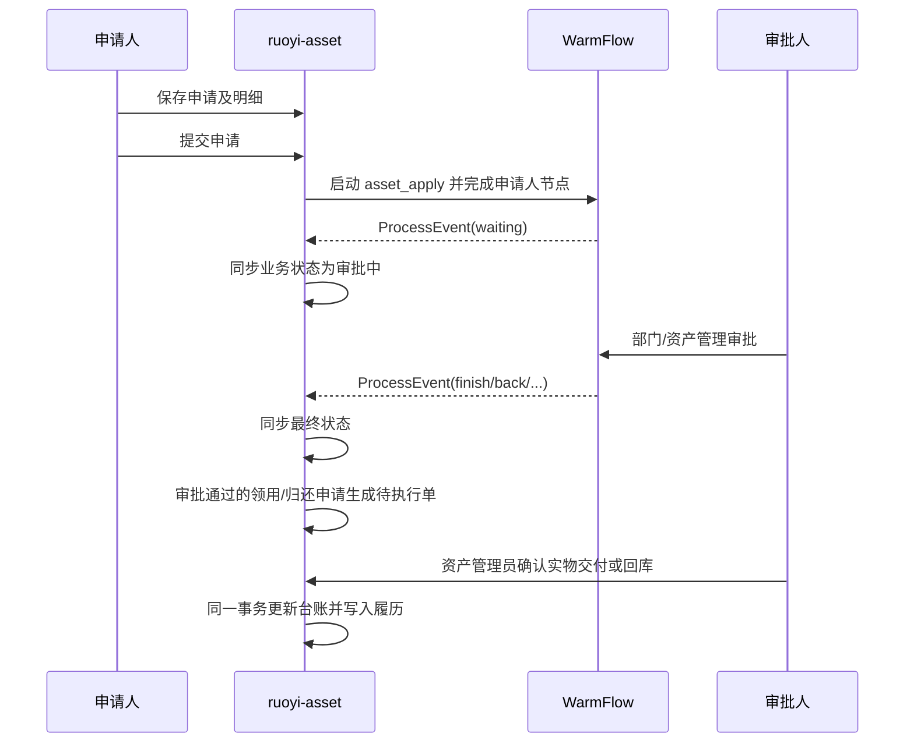

# 系统架构

## 1. 总体结构



后端采用 Maven 多模块结构。`ruoyi-admin` 只负责应用启动和聚合依赖，资产领域代码全部放在 `ruoyi-modules/ruoyi-asset`，避免把业务逻辑混入系统管理模块。

## 2. 资产模块分层

```text
org.dromara.asset
├── controller        REST 接口、权限注解、请求校验、操作日志
├── domain
│   ├── bo            查询/新增/修改入参
│   └── vo            对外响应模型
├── mapper            MyBatis-Plus 数据访问与数据权限
└── service
    └── impl           业务规则、状态机、流程发起与事件同步
```

请求链路：

```text
Vue 页面 → API 封装 → Controller → Service → Mapper → MySQL
                         ↓          ↓
                      RBAC校验   领域规则/数据权限
```

## 3. 与框架能力的边界

| 能力 | 复用框架 | 资产模块新增 |
|---|---:|---:|
| 登录、Token、租户 | 是 | 否 |
| 用户、部门、角色、菜单 | 是 | 否 |
| 操作日志、重复提交防护 | 是 | 否 |
| 数据权限拦截 | 是 | 字段映射与业务接入 |
| 资产分类、台账及规则 | 否 | 是 |
| 流程引擎和任务中心 | 是 | 资产流程定义与业务事件接入 |
| 资产申请、执行单、履历及状态机 | 否 | 是 |
| 资产页面和 API | 否 | 是 |

## 4. 权限设计

- Controller 使用 `@SaCheckPermission` 控制接口操作权限。
- Vue 按钮使用 `v-hasPermi` 控制可见性。
- `AssetInfoMapper` 使用 `@DataPermission` 将组织数据权限映射到 `dept_id`，将本人范围映射到 `keeper_id`。
- 租户隔离复用 `TenantEntity` 和框架租户插件，七张业务表均包含 `tenant_id`。

## 5. 申请审批链路



审批状态与资产状态分离。`finish` 事件只产生待执行授权，资产管理员确认实物已经交付或回库后才更新台账。执行操作使用接口重复提交防护、执行单乐观锁、资产当前状态条件更新和事务回滚四层保护。

## 6. 技术基线

- Java 17 编译目标
- Spring Boot 3.5.x
- MyBatis-Plus
- Sa-Token
- MySQL 8.x、Redis
- Vue 3、TypeScript、Element Plus、Vite 7
- Node.js 20.19+ 或 22.12+
