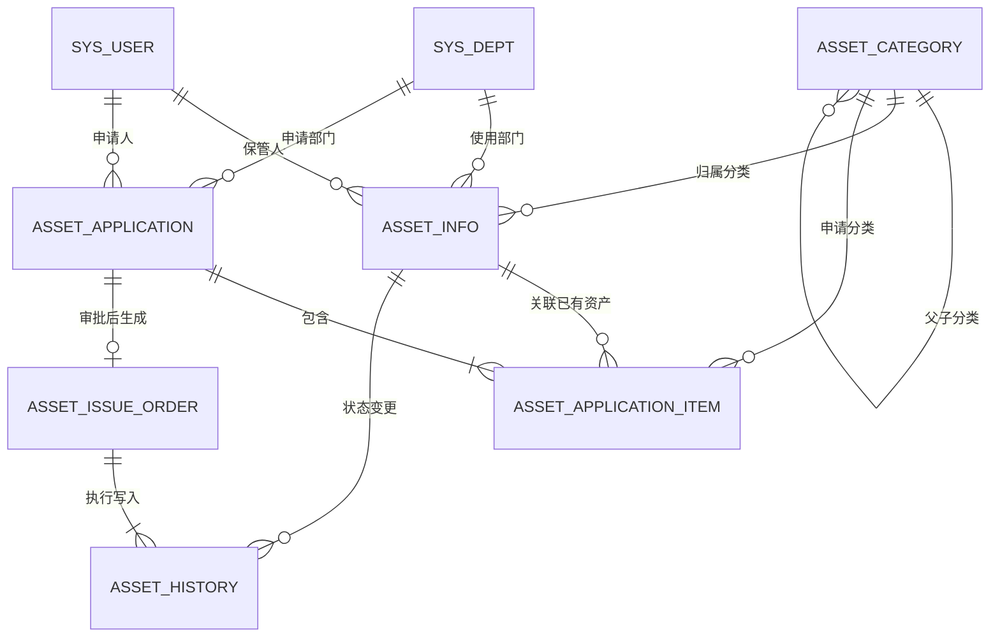

# 数据库设计

## 1. 关系模型

数据库初始化脚本：`script/sql/asset/asset_init.sql`。脚本创建六张业务表、三个初始分类、资产菜单按钮，以及已发布的 `asset_apply` 流程定义，可重复执行且不删除业务数据。

## 2. asset_category

| 字段 | 类型 | 必填 | 说明 |
|---|---|---:|---|
| category_id | bigint | 是 | 雪花主键 |
| tenant_id | varchar(20) | 是 | 租户编号 |
| parent_id | bigint | 是 | 上级分类，0 表示根节点 |
| category_code | varchar(32) | 是 | 租户内唯一业务编码 |
| category_name | varchar(100) | 是 | 分类名称 |
| depreciation_years | int | 否 | 默认折旧年限，0 表示未设置 |
| order_num | int | 否 | 显示顺序 |
| status | char(1) | 是 | 0 正常，1 停用 |
| create_dept/create_by/create_time | - | 否 | 创建审计字段 |
| update_by/update_time | - | 否 | 更新审计字段 |
| remark | varchar(500) | 否 | 备注 |
| del_flag | bigint | 是 | 逻辑删除标志 |

## 3. asset_info

| 字段 | 类型 | 必填 | 说明 |
|---|---|---:|---|
| asset_id | bigint | 是 | 雪花主键 |
| tenant_id | varchar(20) | 是 | 租户编号 |
| asset_code | varchar(64) | 是 | 租户内唯一资产编码 |
| asset_name | varchar(200) | 是 | 资产名称 |
| category_id | bigint | 是 | 资产分类 |
| specification | varchar(200) | 否 | 规格型号 |
| brand | varchar(100) | 否 | 品牌 |
| unit | varchar(20) | 否 | 计量单位 |
| purchase_date | date | 否 | 购置日期 |
| original_value | decimal(18,2) | 否 | 资产原值 |
| asset_status | char(1) | 是 | 0库存、1使用中、2维修中、3调拨中、4已报废 |
| dept_id | bigint | 否 | 使用部门 |
| keeper_id | bigint | 否 | 保管人 |
| location | varchar(200) | 否 | 存放地点 |
| warranty_expiry_date | date | 否 | 保修到期日 |
| create_dept/create_by/create_time | - | 否 | 创建审计字段 |
| update_by/update_time | - | 否 | 更新审计字段 |
| remark | varchar(500) | 否 | 备注 |
| del_flag | bigint | 是 | 逻辑删除标志 |

## 4. asset_application

| 字段 | 类型 | 说明 |
|---|---|---|
| application_id | bigint | 雪花主键 |
| application_no | varchar(40) | 后端生成的申请单号 |
| application_type | varchar(20) | purchase/use/transfer/return/scrap |
| applicant_id/apply_dept_id | bigint | 申请人及申请部门 |
| total_amount | decimal(18,2) | 后端按明细计算的预估总金额 |
| expected_date | date | 期望完成日期 |
| reason | varchar(1000) | 申请原因 |
| status | varchar(20) | 与 `BusinessStatusEnum` 一致的业务状态 |
| flow_code | varchar(40) | 当前固定为 asset_apply |

## 5. asset_application_item

| 字段 | 类型 | 说明 |
|---|---|---|
| item_id/application_id | bigint | 明细主键及申请主键 |
| asset_id | bigint | 已有资产；采购申请允许为空 |
| category_id/item_name | - | 资产分类及名称 |
| specification | varchar(200) | 规格型号 |
| quantity/unit | - | 数量及单位 |
| estimated_unit_price | decimal(18,2) | 预估单价 |
| target_dept_id/target_location | - | 调拨、领用等场景的目标信息 |

## 6. asset_issue_order

| 字段 | 类型 | 说明 |
|---|---|---|
| issue_id/issue_no | bigint/varchar(40) | 主键及后端生成的执行单号 |
| application_id | bigint | 来源领用申请，同一申请只允许一张有效执行单 |
| recipient_id/recipient_dept_id | bigint | 领用人和领用部门 |
| status | varchar(20) | pending/completed |
| issued_by/issued_time | bigint/datetime | 实际执行人和执行时间 |
| version | bigint | 乐观锁版本，防止重复执行 |

执行单不复制申请明细，直接引用审批时已经固化的 `asset_application_item`，避免两份明细产生数据偏差。

## 7. asset_history

| 字段 | 类型 | 说明 |
|---|---|---|
| history_id/asset_id | bigint | 履历主键及资产主键 |
| asset_code/asset_name | varchar | 资产编码与名称快照 |
| business_type/business_id | varchar/bigint | 变更业务类型及来源单据 |
| before_status/after_status | char(1) | 变更前后状态 |
| before_dept_id/after_dept_id | bigint | 变更前后部门 |
| before_keeper_id/after_keeper_id | bigint | 变更前后保管人 |
| before_location/after_location | varchar | 变更前后地点 |
| operator_id/operation_time | bigint/datetime | 操作人及操作时间 |

履历保存关键字段快照，是只增不改的审计数据；当前 `business_type=issue` 表示领用执行。

## 8. 索引策略

- 六张表的常用索引都以 `tenant_id` 开头，适配多租户查询。
- 分类表索引覆盖父节点和分类编码查询。
- 台账表索引覆盖资产编码、分类、部门、保管人和状态查询。
- 编码唯一性由 Service 在租户隔离条件下校验；索引用于查询加速，不使用会阻碍多次逻辑删除的复合唯一约束。

## 9. 当前约束说明

为兼容逻辑删除和多租户插件，本阶段关联完整性由 Service 维护，暂不建立数据库外键。删除分类前会检查子分类和台账引用；修改台账时会检查分类存在且已启用。
