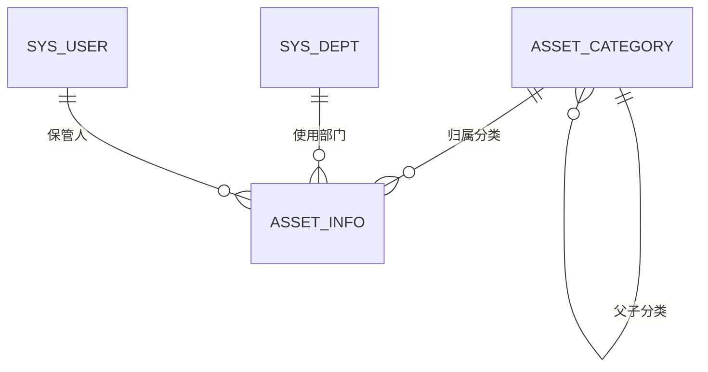

# 数据库设计

## 1. 关系模型

数据库初始化脚本：`script/sql/asset/asset_init.sql`。脚本创建业务表、三个初始分类以及资产菜单和按钮权限，可重复执行且不删除业务数据。

## 2. asset_category

| 字段 | 类型 | 必填 | 说明 |
|---|---|---:|---|
| category_id | bigint | 是 | 雪花主键 |
| tenant_id | varchar(20) | 是 | 租户编号 |
| parent_id | bigint | 是 | 上级分类，0 表示根节点 |
| category_code | varchar(32) | 是 | 租户内唯一业务编码 |
| category_name | varchar(100) | 是 | 分类名称 |
| depreciation_years | int | 否 | 默认折旧年限，0 表示未设置 |
| order_num | int | 否 | 显示顺序 |
| status | char(1) | 是 | 0 正常，1 停用 |
| create_dept/create_by/create_time | - | 否 | 创建审计字段 |
| update_by/update_time | - | 否 | 更新审计字段 |
| remark | varchar(500) | 否 | 备注 |
| del_flag | bigint | 是 | 逻辑删除标志 |

## 3. asset_info

| 字段 | 类型 | 必填 | 说明 |
|---|---|---:|---|
| asset_id | bigint | 是 | 雪花主键 |
| tenant_id | varchar(20) | 是 | 租户编号 |
| asset_code | varchar(64) | 是 | 租户内唯一资产编码 |
| asset_name | varchar(200) | 是 | 资产名称 |
| category_id | bigint | 是 | 资产分类 |
| specification | varchar(200) | 否 | 规格型号 |
| brand | varchar(100) | 否 | 品牌 |
| unit | varchar(20) | 否 | 计量单位 |
| purchase_date | date | 否 | 购置日期 |
| original_value | decimal(18,2) | 否 | 资产原值 |
| asset_status | char(1) | 是 | 0库存、1使用中、2维修中、3调拨中、4已报废 |
| dept_id | bigint | 否 | 使用部门 |
| keeper_id | bigint | 否 | 保管人 |
| location | varchar(200) | 否 | 存放地点 |
| warranty_expiry_date | date | 否 | 保修到期日 |
| create_dept/create_by/create_time | - | 否 | 创建审计字段 |
| update_by/update_time | - | 否 | 更新审计字段 |
| remark | varchar(500) | 否 | 备注 |
| del_flag | bigint | 是 | 逻辑删除标志 |

## 4. 索引策略

- 两张表的常用索引都以 `tenant_id` 开头，适配多租户查询。
- 分类表索引覆盖父节点和分类编码查询。
- 台账表索引覆盖资产编码、分类、部门、保管人和状态查询。
- 编码唯一性由 Service 在租户隔离条件下校验；索引用于查询加速，不使用会阻碍多次逻辑删除的复合唯一约束。

## 5. 当前约束说明

为兼容逻辑删除和多租户插件，本阶段关联完整性由 Service 维护，暂不建立数据库外键。删除分类前会检查子分类和台账引用；修改台账时会检查分类存在且已启用。
