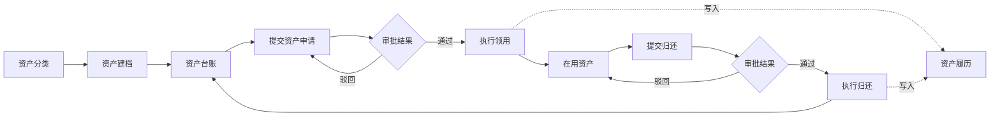

# 企业资产全生命周期管理平台前端

本目录是企业资产全生命周期管理平台的 Web 管理端。前端围绕资产分类、资产台账、资产申请、审批授权、领用、归还和资产履历组织页面，不使用上游框架的通用后台演示图作为本项目功能展示。

## 当前业务页面

| 业务页面 | 主要能力 | 前端目录 | 权限标识 |
| --- | --- | --- | --- |
| 资产分类 | 分类树维护、编码校验、启停管理 | `src/views/asset/category` | `asset:category:*` |
| 资产台账 | 资产建档、查询、编辑、状态展示 | `src/views/asset/info` | `asset:info:*` |
| 资产申请 | 领用、归还、调拨等申请及审批进度 | `src/views/asset/application` | `asset:application:*` |
| 领用执行 | 审批通过后执行领用并更新保管状态 | `src/views/asset/issue` | `asset:issue:*` |
| 归还执行 | 校验当前保管人、完成回库 | `src/views/asset/return` | `asset:return:*` |
| 资产履历 | 查看资产状态、责任人和业务单据时间轴 | `src/views/asset/history` | `asset:history:list` |

## 业务图例

以下图例与当前资产模块的实现保持一致，用于说明页面之间的业务关系，不代表尚未实现的采购、盘点或报废功能。



界面展示以当前本地运行版本为准。新增截图时必须满足以下要求：

- 使用本项目真实页面，不复用 RuoYi/plus-ui 上游演示截图；
- 隐去账号、手机号、Token、内网地址及真实组织数据；
- 截图涉及的菜单、字段和流程必须已经在当前代码中实现；
- 页面发生明显改版时，同步更新截图和本说明。

## 技术栈

- Vue 3 + TypeScript
- Vite
- Element Plus
- Pinia
- Vue Router
- Axios
- ECharts
- pnpm 锁定依赖版本

具体依赖版本以 `package.json` 和 `pnpm-lock.yaml` 为准，不在文档中重复维护容易过期的版本号。

## 本地运行

```bash
pnpm install --frozen-lockfile
pnpm dev
```

默认访问地址：`http://localhost:5173`

生产构建与资产域质量检查：

```bash
pnpm lint:eslint src/views/asset src/api/asset
pnpm typecheck:asset
pnpm build:prod
```

后端服务默认运行在 `http://localhost:8080`。本地接口地址、密钥及其他环境差异配置应写入未提交的 `.env` 文件，不能写入源码或截图。

## 目录说明

```text
src/
├── api/asset/       # 资产领域接口与类型
├── views/asset/     # 资产领域页面
├── views/index.vue  # 项目首页与业务概览
├── router/          # 路由与权限守卫
└── store/           # 登录态与全局状态
```

## 开源来源与协议

本前端基于 [RuoYi-Plus-Uni-App/plus-ui](https://github.com/JavaLionLi/plus-ui) 进行二次开发，并与 [Dromara/RuoYi-Vue-Plus](https://github.com/dromara/RuoYi-Vue-Plus) 后端配套使用。上游提供通用登录、权限、菜单和工程化基础；本仓库新增并维护企业资产领域页面、交互和接口类型。

项目继续保留根目录及前后端目录中的开源协议和来源说明。使用、修改或再分发时，请同时遵守仓库内 `LICENSE` 及相关依赖的许可证要求。
